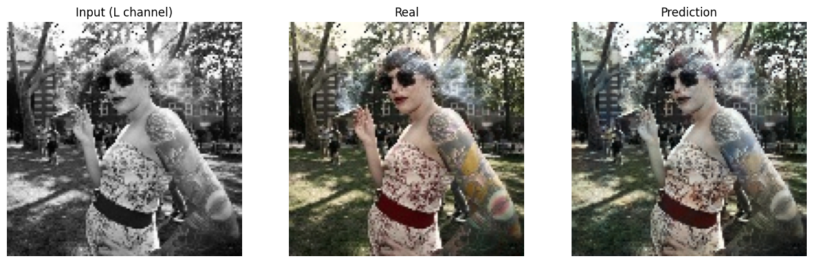
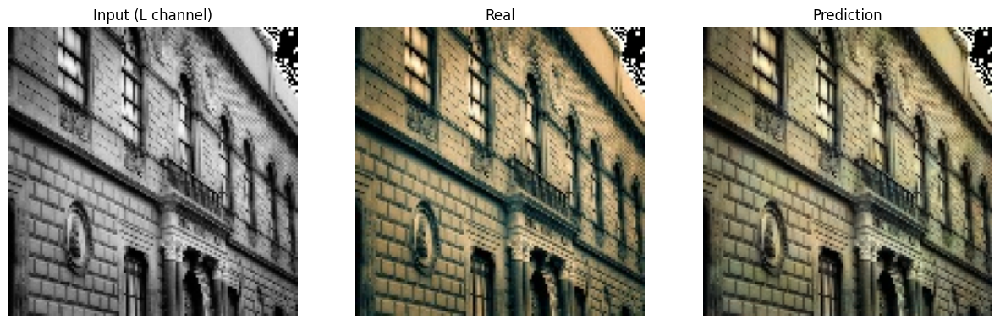
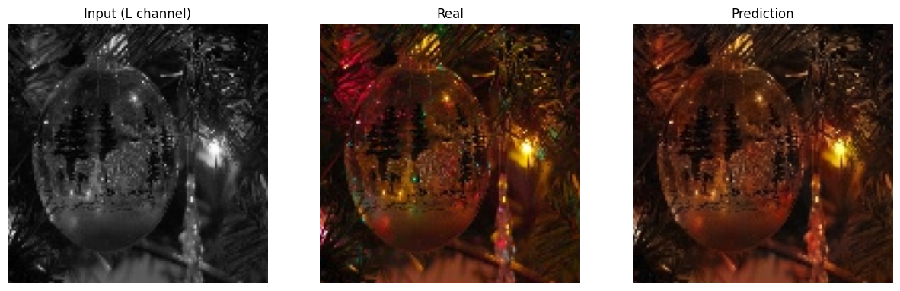
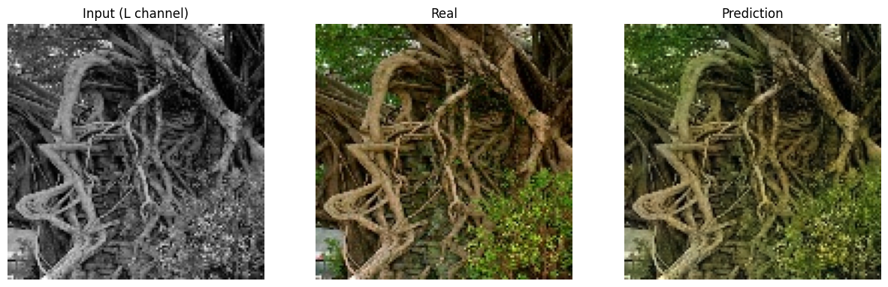
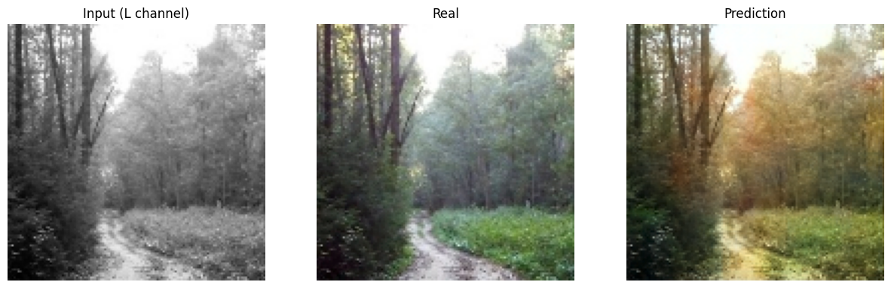
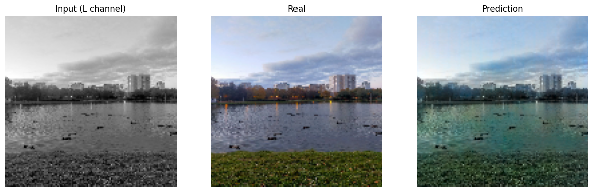
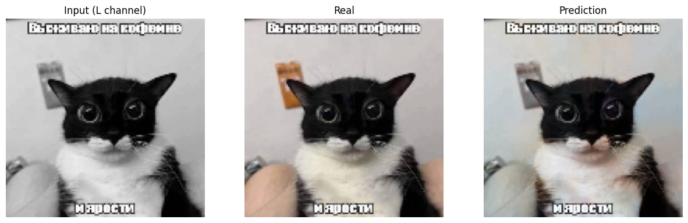
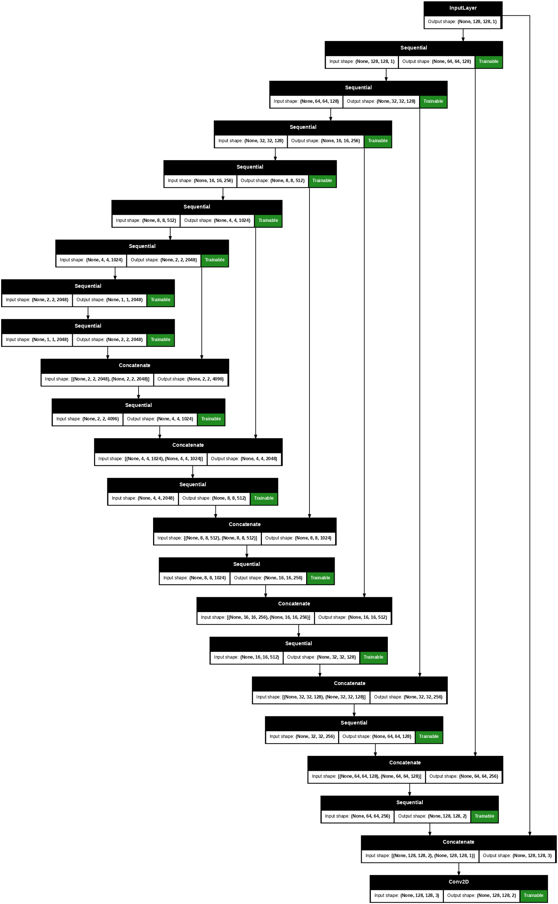

# Model
Current version U-net
# Model weights
[weight](https://huggingface.co/DeZtrOiD/ML_colorizer/blob/main/ML/weights/5_128_2048_checkpoint.weights.h5)

# Examples of use

# Model architecture:

